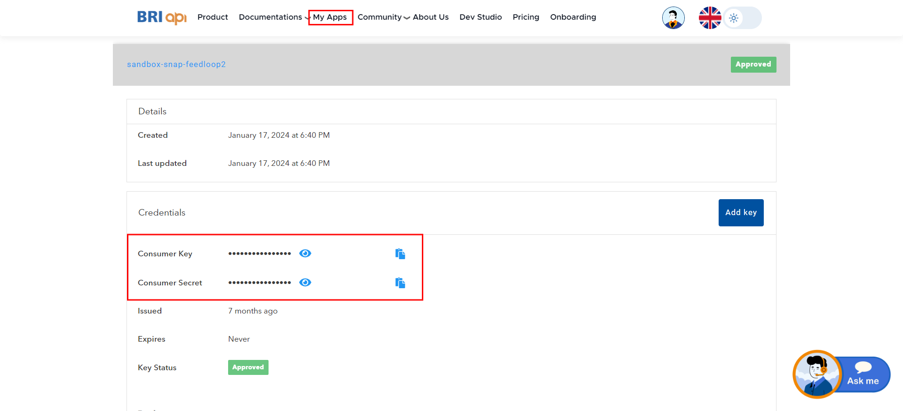

# Template Valas

This is a simple template for Valas 2.0 NON SNAP using PHP.

module:
- [Info Kurs Counter](https://developers.bri.co.id/id/docs/api-specification-valas-20)
- [Valas Nego Info](https://developers.bri.co.id/id/docs/api-specification-valas-20)
- [Check Deal Code](https://developers.bri.co.id/id/docs/api-specification-valas-20)
- [Transaction Valas](https://developers.bri.co.id/id/docs/api-specification-valas-20)
- [Transaction Valas Non Nego](https://developers.bri.co.id/id/docs/api-specification-valas-20)
- [Inquiry Transaction](https://developers.bri.co.id/id/docs/api-specification-valas-20)
- [Inquiry Limit](https://developers.bri.co.id/id/docs/api-specification-valas-20)
- [Upload Underlying](https://developers.bri.co.id/id/docs/api-specification-valas-20)

## List of Content
- [Instalasi](#instalasi)
  - [Prerequisites](#prerequisites)
  - [How to Setup Project](#how-to-setup-project)
  - [Info Kurs Counter](#info-kurs-counter)
  - [Valas Nego Info](#valas-nego-info)
  - [Check Deal Code](#check-deal-code)
  - [Transaction Valas](#transaction-valas)
  - [Transaction Valas Non Nego](#transaction-valas-non-nego)
  - [Inquiry Transaction](#inquiry-transaction)
  - [Inquiry Limit](#inquiry-limit)
  - [Upload Underlying]()
- [Caution](#caution)
- [Disclaimer](#disclaimer)

## Instalasi

### Prerequisites
- php
- composer

### How to Setup Project

```bash
1. run command `cd template-valas` to change directory
2. copy .env file by typing `cp .env.example .env` in the terminal
3. fill the .env file with the required values
4. run composer install to install all dependencies
```

### Info Kurs Counter
```bash
1. fill variable $dealtCurrency, this variable must fill with format currency code (ISO 4217) eg: USD
2. fill variable $counterCurrency, this variable must fill with format currency code (ISO 4217) eg: IDR
3. fill variable $partnerCode, eg: 'rxEG1EMYHQZMgb3'
3. run command `php src/info_kurs_counter.php serve`
```

### Valas Nego Info
```bash
1. fill variable $dealtCurrency, this variable must fill with format currency code (ISO 4217) eg: USD
2. fill variable $counterCurrency, this variable must fill with format currency code (ISO 4217) eg: IDR
3. fill variable $partnerCode, eg: 'rxEG1EMYHQZMgb3'
4. run cammand `php src/valas_nego_info.php serve`
```

### Check Deal Code
```bash
1. fill variable $dealCode, eg: 'O0003540'
3. fill variable $partnerCode, eg: 'rxEG1EMYHQZMgb3'
3. run command `php src/check_deal_code.php serve`
```

### Transaction Valas
```bash
1. fill variable $debitAccount, eg: '030702000141509'
2. fill variable $creditAccount, eg: '034401083104504'
3. fill variable $dealCode, eg: 'O0003540'
4. fill variable $remark, eg: '374628374'
5. fill variable $partnerReferenceNo, eg: '6278163827788'
6. you can skip variable $underlyingReference, eg: '12345', because optional parameter
7. fill variable $partnerCode, eg: 'rxEG1EMYHQZMgb3'
8. run command `php src/transaction_valas.php serve`
```

### Transaction Valas Non Nego
```bash
1. fill variable $debitAccount, eg: '030702000141509'
2. fill variable $creditAccount, eg: '034401083104504'
3. fill variable $debitCurrency, eg: 'USD'
4. fill variable $creditCurrency, eg: 'IDR'
5. fill variable $remark, you can generate with (new GenerateRandomString())->generate(9)
6. fill variable $partnerReferenceNo, you can generate with (string) (new VarNumber())->generateVar(13)
7. fill variable $debitAmount, eg: '3.00'
8. fill variable $partnerCode, eg: 'rxEG1EMYHQZMgb3'
9. run command `php src/transaction_valas_non_nego.php serve`
```

### Inquiry Transaction
```bash
1. fill variable $originalPartnerReferenceNo, eg: '6278163432827927'
2. fill variable $originalReferenceNo, eg: '8535101'
3. fill variable $partnerCode, eg: 'rxEG1EMYHQZMgb3'
4. run command `php src/inquiry_transaction.php serve`
```

### Inquiry Limit
```bash
1. fill variable $debitAccount, eg: '020602000008513'
2. fill variable $partnerCode, eg: 'rxEG1EMYHQZMgb3'
3. run command `php src/inquiry_limit serve`
```

### Upload Underlying
```bash
1. upload some file into assets (by default have image.png)
2. fill variable $path to file that uploaded, eg: assets/image.png
3. fill variable $partnerCode, eg: 'rxEG1EMYHQZMgb3'
4. run command `php src/upload_underlying.php serve`
```

## .ENV Example
you can find consumer key and consumer secret in https://developers.bri.co.id

click menu My Apps then select apps



```bash
CONSUMER_KEY=pqYYBsSc6rHwCqp6o4R8ExmBRubEpqtY 
CONSUMER_SECRET=idbaNFh0mGSZ7xol
```

## Caution

Please delete the .env file before pushing to github or bitbucket

## Disclaimer

Please note that this project is just a template on the use of BRI-API php sdk and may have bugs or errors.
